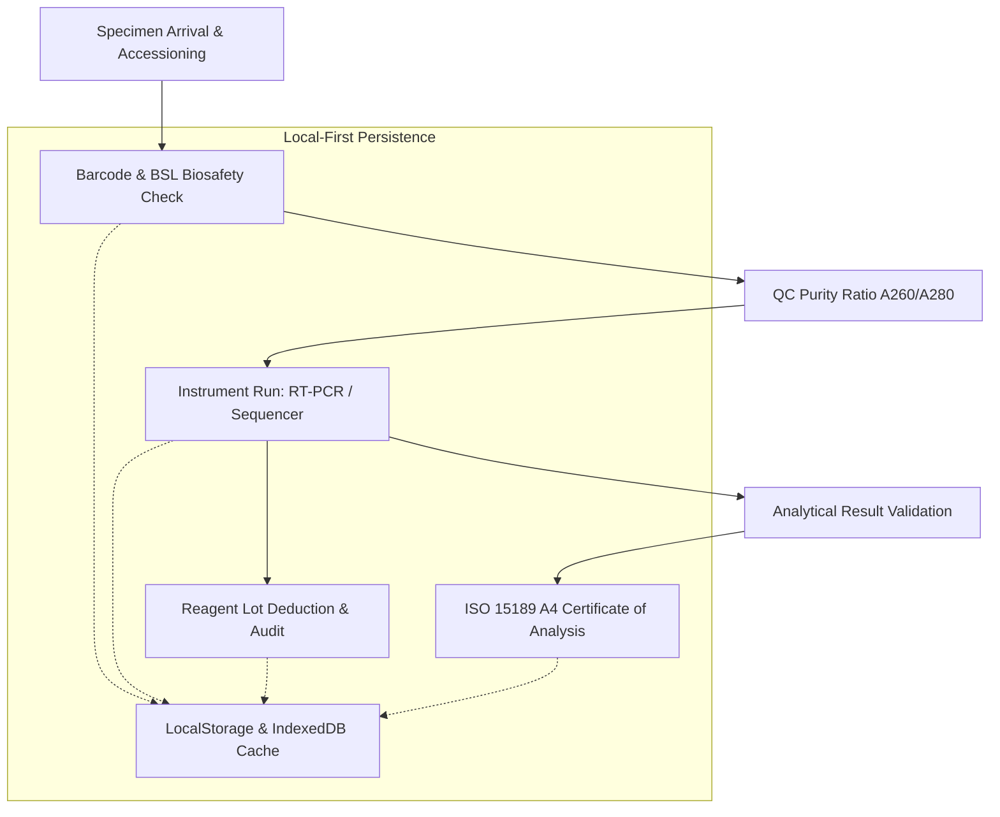

# 🔬 BioLab LIMS — Biotech & Clinical Pathology Laboratory Information Management System

<p align="center">
  
  
  
  
  
  
  
  
</p>

> 🚀 **Live Production Application:** [https://olyxmintabansos-byte.github.io/biolab-lims/](https://olyxmintabansos-byte.github.io/biolab-lims/)

---

### 🌐 System Overview & Vision

**BioLab LIMS (Titan #33)** adalah sistem manajemen laboratorium bioteknologi dan patologi klinis enterprise (*Laboratory Information Management System*) yang dirancang sesuai standar akreditasi internasional **ISO 15189** dan prinsip **Good Laboratory Practice (GLP)**.

Dibangun dengan arsitektur **Client-Side Local-First**, BioLab LIMS memproses penerimaan spesimen biologis (*accessioning*) dengan barcode, pemantauan status instrumen RT-PCR dan Next-Gen Sequencer, inventaris reagen kriogenik (-80°C), serta penerbitan sertifikat analisis laboratorium (*Certificate of Analysis / COA*) format A4 resmi tanpa ketergantungan server runtime atau latensi jaringan.

---

### 🎨 Design System: #8 Flat Design + Clinical Sterile Grid

Antarmuka BioLab LIMS dirancang khusus untuk kenyamanan teknisi laboratorium di bawah pencahayaan klinis:
- **Clean Sterile Grid**: Garis batas struktural setebal 1px (`border-slate-200` & `border-slate-800`) tanpa bevel atau gradien semu, memberikan kepadatan informasi (*high data density*) yang jernih.
- **Biocontainment Color Coding**: Penandaan visual biosafety level (BSL-1 Gray, BSL-2 Amber, BSL-3 High Containment Rose/Red).
- **Subdued Medical Palette**: Latar putih bersih steril (`#FAFAFA`), Clinical Slate (`#1E293B`), Accent Biotech Blue (`#0284C7`), dan Reagent Emerald (`#059669`).

---

### 🌟 Key Functional Pillars

#### 1. 🧪 Specimen Accessioning & PCR Workflow (`/`)
- **Biological Specimen Intake**: Penerimaan sampel darah EDTA, serum clot activator, DNA genomik murni, swab nasofaring VTM, dan supernatan kultur sel.
- **Barcode & BSL Classification**: Penomoran kode batang instan, penentuan klasifikasi tingkat bahaya biologis (BSL-1 s/d BSL-3), serta tracking lokasi rak freezer.
- **QC Purity Assessment**: Validasi rasio absorbansi kemurnian DNA/RNA (A260/A280 nm) secara otomatis sebelum masuk ke tahap ekstraksi dan amplifikasi.

#### 2. 🎛️ Diagnostic Instruments & Automated Analyzers (`/instruments`)
- **Telemetry Real-Time**: Pemantauan instrumen otomatis:
  - Real-Time RT-PCR Thermal Cyclers (suhu blok °C, siklus amplifikasi berjalan).
  - Next-Generation Sequencers (NGS flow cell status).
  - UV-Vis Microdrop Spectrophotometers.
  - Automated Hematology 5-Part Differential Analyzers.
- **Operator Attribution**: Pencatatan ID analis/operator dan verifikasi kalibrasi harian instrumen.

#### 3. ❄️ Cryogenic Inventory & Reagent Lot Control (`/reagents`)
- **Cold-Chain Tracking**: Monitoring stok reagen suhu kamar (+20°C), chiller (+4°C), freezer (-20°C), hingga tangki kriogenik ultra-dingin (-80°C).
- **Lot Expiry & Safety Alerts**: Peringatan otomatis menjelang tanggal kedaluwarsa reagen sensitif, status sisa volume (mL/tes), dan registrasi sertifikat CoA pabrikan.

#### 4. 📑 ISO 15189 Certified COA A4 Generator (`/coa`)
- **Clinical Pathology Report**: Penerbitan lembar hasil pemeriksaan laboratorium format resmi kertas A4 standar akreditasi ISO 15189.
- **Pathologist Digital Stamp**: Verifikasi tanda tangan digital Dokter Spesialis Patologi Klinis / Kepala Laboratorium, nilai rujukan normal, dan keterangan interpretasi klinis.

---

### 🏗️ Architecture & Data Flow



---

### 📁 Directory Layout

```
biolab-lims/
├── public/
│   └── .nojekyll                 # Jekyll bypass for GitHub Pages
├── src/
│   ├── app/
│   │   ├── coa/page.tsx          # ISO 15189 Certificate of Analysis (COA) generator
│   │   ├── instruments/page.tsx  # RT-PCR & sequencer instruments telemetry
│   │   ├── reagents/page.tsx     # Reagent lots & cryogenic -80°C inventory
│   │   ├── layout.tsx            # Global layout with Flat Clinical Sterile styling
│   │   └── page.tsx              # Specimen accessioning & PCR workstation
│   ├── components/
│   │   └── Navbar.tsx            # Flat sterile header & BSL status monitor
│   ├── context/
│   │   └── LimsContext.tsx       # LIMS reactive state machine & specimen records
│   └── types/
│       └── lims.ts               # Biological specimens, instruments & QC types
├── next.config.ts                # Static export configuration
└── package.json                  # Dependencies & scripts
```

---

### 🛠️ Technology Stack

| Domain | Technology / Library | Rationale |
|---|---|---|
| **Framework** | Next.js 16.3 (App Router) | Static export optimized for air-gapped clean laboratories |
| **Language** | TypeScript (Strict Mode) | Type-safe diagnostic units and molecular biology schema models |
| **Styling** | Tailwind CSS v4 | High-density flat borders and clinical grid styling |
| **Icons & UI** | Lucide React | Precision scientific, chemical, and medical iconography |
| **Visual FX** | Canvas-Confetti | Validation celebration on diagnostic release |
| **Persistence** | Local-First Storage | Patient privacy compliance without remote telemetry leakage |
| **Deployment** | GitHub Pages (`gh-pages`) | Static hosting with `.nojekyll` bypass |

---

### 🚀 Getting Started & Local Development

Clone repositori dan jalankan pada local development environment:

```bash
# 1. Clone repository
git clone https://github.com/olyxmintabansos-byte/biolab-lims.git
cd biolab-lims

# 2. Install dependencies
npm install

# 3. Jalankan development server
npm run dev
```

Buka [http://localhost:3000](http://localhost:3000) pada browser Anda.

#### Build & Static Export

```bash
# Build static export ke direktori out/
npm run build

# Deploy langsung ke GitHub Pages branch gh-pages
npx --yes gh-pages -d out -b gh-pages --dotfiles
```

---

### 📄 License & Attribution

Didistribusikan di bawah lisensi MIT. Silakan gunakan untuk rumah sakit, pusat riset genomik, laboratorium patologi, maupun universitas.

<p align="center">
  
  
</p>

<p align="center">
  <strong>© 2026 by Olyx (@olyxmintabansos-byte)</strong> • All rights reserved.
</p>
